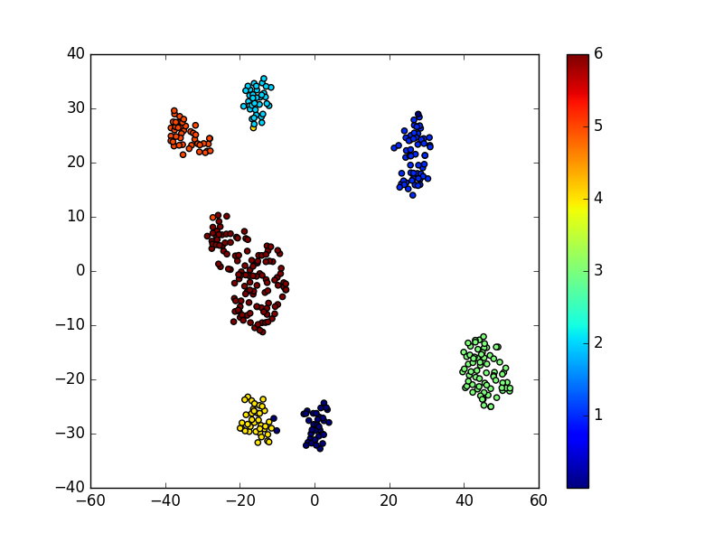
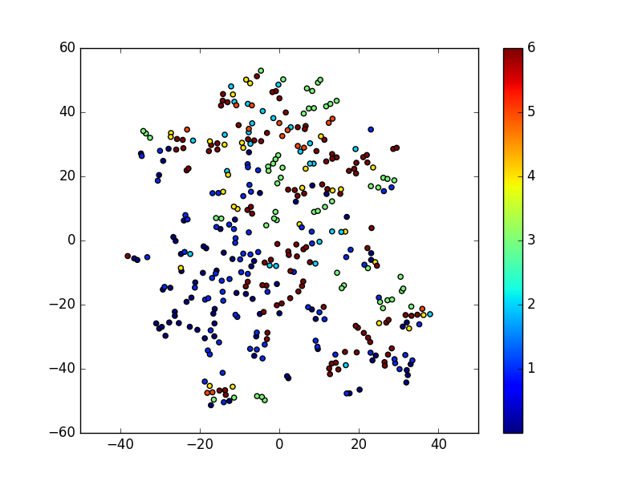
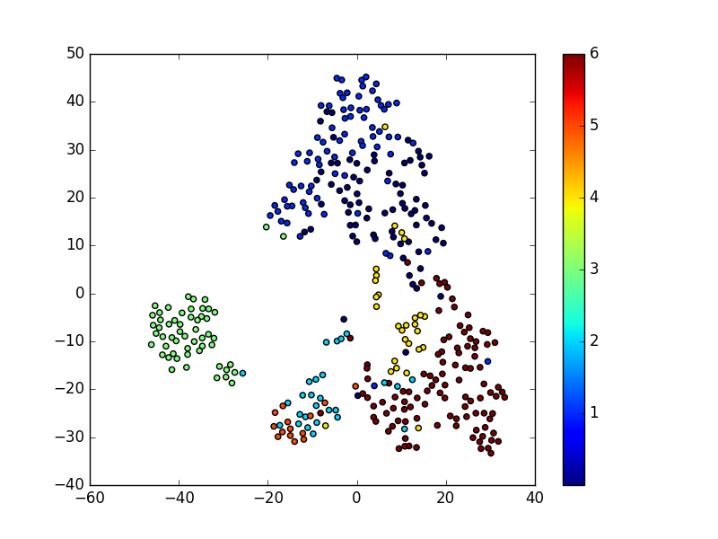
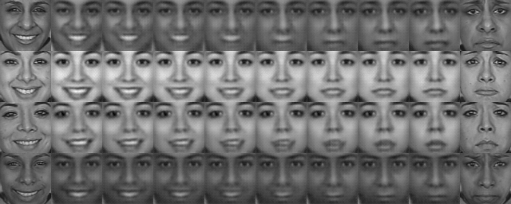
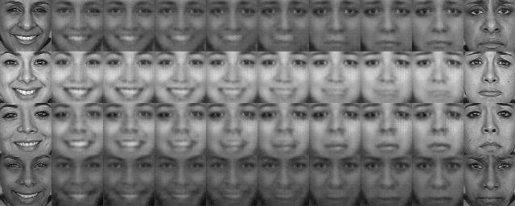
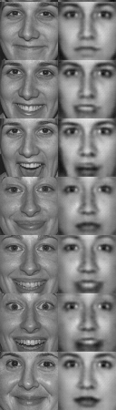
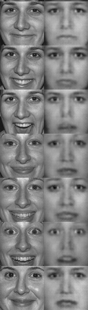

# MetricVAE
Training a VAE with distance regularization

# Overview

The code in expr_classifer trains a classifier on the Toronto Face Dataset (TFD) images using expression labels and then outputs an array containing a mapping of the original data into the last layer of the classifier. This transformation of the data is used to define a metric on TFD which can then by utilized by the code in metric_vae.

The code in metric_vae trains a VAE on TFD along with a modified loss function which includes a distance regularization term which encourages preservation of the distances given by the metric outputted by expr_classifier. Any other metric can also be used here.

# Example

A tsne visualization of the mapping of the TFD data into the last layer of a trained expression classifier.



We use this classifier to obtain a metric between faces in the following way.
Let  be the classifier.
Given faces ,  we define the distance between them as =\Vert&space;C(x_1)-C(x_2)&space;\Vert) where  denotes Euclidean distance.

We then train a VAE on the TFD dataset using the usual loss function along with an additional regularization term which encourages preserving the distance in the latent space.

In the following visualizations the first image corresponds to the model with no distance regularizer.

We visualize the encoded data (that is the latent space of the VAE) using tsne. 





Interpolations from happy to sad face:

 



We perform some basic arithmetic on the encodings of the images. In the following we understand all images to be encoded (lying in latent space).
Let  be the mean of the happy faces. Let  be the mean of the sad faces.
Given a happy face  we let . 
The first column of each image is  and the second column is .

        


# Instructions

To experiment with the code yourself download (a processed version of) the TFD data files from [here](https://www.dropbox.com/sh/rlcc6araq63fxnr/AACAQBEvGmfXKclP1ZMoe3kza?dl=0) and place in a folder named 'data'.


To run the two parts above in sequence use
```
python run.py
```
Then to obtain the above visulations use

```
experiments.py
```

# Acknowledgements

Thanks to Jake Snell for help with some of the above code.
